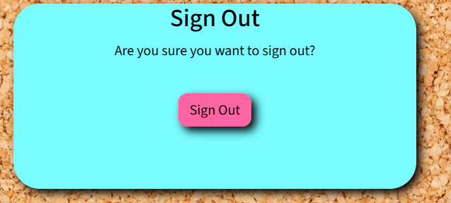

# Post It


## Introduction

Post It is a website that aims to keep users informed about upcoming comunity events. This website has been developed as part of the Code Institute’s Full-Stack Developer Bootcamp course and is our final Hackathon project - focusing on a Django framework, Database manipulation, and CRUD functionality, and working as a team using agile methodologies. This project is for educational purposes only.

View live site here : [Post It](https://post-it-project-a1c97a5ab437.herokuapp.com/)  
  
For Admin access with relevant sign-in information: [Post It Admin](https://post-it-project-a1c97a5ab437.herokuapp.com/admin)

<hr>

## Table of Contents

- [Post It](#post-it)
  - [Introduction](#introduction)
  - [Table of Contents](#table-of-contents)
  - [Overview](#overview)
- [UX - User Experience](#ux---user-experience)
  - [Colour Scheme](#colour-scheme)
  - [Font](#font)
- [Project Planning](#project-planning)
  - [Strategy Plane](#strategy-plane)
    - [Site Goals](#site-goals)
  - [Agile Methodologies - Project Management](#agile-methodologies---project-management)
    - [MoSCoW Prioritization](#moscow-prioritization)
  - [User Stories](#user-stories)
    - [Visitor User Stories](#visitor-user-stories)
  - [Scope Plane](#scope-plane)
  - [Structural Plane](#structural-plane)
  - [Skeleton \& Surface Planes](#skeleton--surface-planes)
    - [Wireframes](#wireframes)
    - [Database Schema - Entity Relationship Diagram](#database-schema---entity-relationship-diagram)
    - [Security](#security)
- [Features](#features)
  - [User View - Registered/Unregistered](#user-view---registeredunregistered)
  - [CRUD Functionality](#crud-functionality)
  - [Feature Showcase](#feature-showcase)
  - [Future Features](#future-features)
- [Technologies \& Languages Used](#technologies--languages-used)
  - [Libraries \& Frameworks](#libraries--frameworks)
  - [Tools \& Programs](#tools--programs)
- [Testing](#testing)
- [Deployment](#deployment)
  - [Connecting to GitHub](#connecting-to-github)
  - [Django Project Setup](#django-project-setup)
  - [Cloudinary API](#cloudinary-api)
  - [PostgreSQL from Code Institute](#postgreSQL-from-code-institute)
  - [Heroku deployment](#heroku-deployment)
- [Credits](#credits)
  - [Content References](#content-references)
  - [Media Refernces](#media-references)
  - [Acknowledgements](#acknowledgements)

## Overview

Post It is a website designed to keep users informed of upcoming community events. Users are invited to:

- Join the Post It community
- Interact with posts through the comments section

Post It is accessible via all browsers with full responsiveness on different screen sizes. Its aim is to create a space where users can read about upcoming events and provide comments about their own experiences. The aim of the site is to support these events and drive customers to them where possible via positive event posts.  

# UX - User Experience

### Colour Scheme

The idea of the website is to have events posted on a post it note on a corkboard. The colour scheme reflected the traditional colours of a Post It note.

  

### Font

In terms of Font style we opted for [Source Sans 3](https://fonts.google.com/specimen/Source+Sans+3)
  
# Project Planning  
 
## Strategy Plane

The project goal was to build a simple website showcasing upcoming community events with the option to have a dynamic conversation about the event posts using the comments section. Our intention is to showcase community events. 

### Site Goals

- Create an environment where people could discuss community events.
- Easy UI for quick fulfilment of feature CRUD functionalities.
- UX remain the same whether on mobile, tablet or desktop

## Agile Methodologies - Project Management

 Post It is our third project following Agile planning methods. We used our [Github Projects Board](https://github.com/users/Yazhmd/projects/4) to plan and document all of our work.

### MoSCoW Prioritization

We chose to follow the MoSCoW Prioritization method for Post It, identifying and labelling our:

- **Must Haves**: the 'required', critical components of the project. Completing my 'Must Haves' helped me to reach the MVP (Minimum Viable Product) for this project early, allowing me to develop the project further than originally planned. 
- **Should Haves**: the components that are valuable to the project but not absolutely 'vital' at the MVP stage. The 'Must Haves' must receive priority over the 'Should Haves'.
- **Could Haves**: these are the features that are a 'bonus' to the project, it would be nice to have them in this phase, but only if the most important issues have been completed first and time allows.
- **Won't Haves**: the features or components that either no longer fit the project's brief or are of very low priority for this release. 

## User Stories

User stories and features recorded and managed on [GitHub Projects](https://github.com/users/Yazhmd/projects/4)

### User Stories Key

| Color | Priority        | MoSCoW Priority Description                                                 |
|:-----:|:----------------|:----------------------------------------------------------------------------|
|  🟢   | **Must Have**   | Essential/mandatory elements that must be included on the project           |
|  🟡   | **Should Have** | Important elements that should only be included with careful consideration. |
|  🟠   | **Could Have**  | Desirable elements that could be included if resources and time allow.      |
|  🔴   | **Won't Have**  | Elements that are **out-of-scope**.                                         |


|                  Title                  | User Story                                                                                                                                                       | MoSCoW |
|:---------------------------------------:|:-----------------------------------------------------------------------------------------------------------------------------------------------------------------|:------:|
| Admin Story : Admin Dashboard (Backend) | As an admin, I want a dashboard to manage events so that I can efficiently track and modify event details.                                                       |   🟢   |
|    User Story : User Authentication     | As a system, I want to implement user authentication so that only authorized users can access certain features of the platform.                                  |   🟢   |
|   Admin Story : Admin Event Creation    | As an admin, I want to create an event with basic details so that users can view and interact with the event information.                                        |   🟢   |
|      User Story : User Event Feed       | As a user, I want to view all posted events in a centralized feed so that I can stay informed about upcoming activities.                                         |   🟡   |
|      User Story : Event Commenting      | As a user, I want to comment on events so that I can engage with event content and interact with other users.                                                    |   🟠   |
|    User Story: Social Account Login     | As a user, I want to log in to the Post It site using my existing social media accounts so that I can quickly register and access the site's features.           |   🟠   |
|    User Story: User Profile Account     | As a user, I want to be able to create a profile where I can view certain events and add them to my watch list and receive notifications on any upcoming events. |   🔴   |
|       User Story : Business Pages       | As a business, I want to sign up and advertise when I will be attending events so that I can promote my presence and attract attendees.                          |   🔴   |
| User Story : Picture Gallery for Posts  | As a community member, I want to post images of my time spent at an event so that I can share my experiences with others.                                        |   🔴   |


## Scope Plane

As this would be a dual learning/building project using technologies that were still relatively new to us, such as Django, SQL, Bootstrap and Cloudinary, we were cautious to maintain consistent control over the scope of the project and not let the idea grow too big. We needed to lockdown project features down early early so as not to lose track of the MVP. Following Agile Planning Methodologies, we added User Stories as issues on the [GitHub Projects](https://github.com/users/Yazhmd/projects/4) to keep the flow of the project in check.

Essential features of my project were:
- An accessible website that fulfils user needs
- Responsive website for users of mobile, tablet and desktop devices
- User Authentication
- Comment feature with full CRUD functionality

Planning the project thoroughly from the start allowed us to identify areas of importance for MVP completion and satisfaction of assessment criteria, and to balance them with the feasibility of the features.

## Structural Plane

From initial concept through to finished product we opted to use standard navigation elements to keep with the theme of familiarity. Bootstrap was used to help control the flexibility of the site across multiple screen sizes. 

## Skeleton & Surface Planes

### Wireframes

The wireframes for Post It were made using Figma. We were sure of the structure of the site and had a general feel of how the colour scheme would work within the structure prior to beginning the project but was prepared to adapt as the project reached its conclusion. Wireframes as below have only been created for Paginated Posts, and Individual Post pages as all login and registration forms would be created by Allauth.

**Mobile and Desktop views for:**
 
- Paginated posts
- Blog post
 
<details open>
  <summary>Paginated posts Wireframe(laptop)</summary>
  
</details>

<details open>
  <summary>Paginated posts Wireframe(mobile)</summary>
  
</details>

<details open>
  <summary>Event posts Wireframe(desktop)</summary>
  
</details>

<details open>
  <summary>Event posts Wireframe(mobile)</summary>
  
</details>

### Database Schema - Entity Relationship Dagram


*Database Schema (ERD) for Post It diaplaying relationships between feature components saved within the database*

This Entity Relationship Diagram(ERD) demonstrates how each feature interacts with each other and the connected PostgreSQL Database. Using Django's User Model, and Django AllAuth to carry out all user authentication, a user_id is created when the user registers with their username and email(optional). This allows the user to add and edit comments, all of which will display their username. 

The User, Post and Comments Models were inspired by the blog walkthrough by the Code Institute. This helped me to get a grasp of the templating structure and connected Python files.

### Security

A number of security steps were taken in this project in order to protect the user's submitted data. Unlike a strictly informative website, Post It allows the user to become part of the community, create comments, and interact with them. To meet the strict internet standards of protecting a user's data, the following processes were included in the project's development.

**AllAuth**  

Django AllAuth is an installable framework that takes care of the user registration and authentication process. Authentication was needed to determine when a user was registered or unregistered and it controlled who could add comments to the posts. The setup of AllAuth included:

- installing it to my workspace dependencies
- adding it to my INSTALLED_APPS in my settings.py
- sourcing the AUTHENTICATION_BACKENDS from the Codestar walkthrough for my settings.py
- adding its URL to my projects 'urls.py'
- run database migrations to create the tables needed for AllAuth
- For this version of Post It, to meet MVP, email and social accounts were not configured as part of the feedback/sign up options to the user.
  
**Defensive Design**  

Post It was developed to ensure a smooth user experience, to the best of our current learning experience with Django. 

- Input validation and error messages provide feedback to the user to guide them towards the desired outcome. 
- Authentication processes control edit/delete icons to reveal them to the post and comment author only. 
- Deletion of comment data is confirmed through an additional modal, double-checking with the user.
- Testing and validation of features completes the process.

**CSRF Tokens** 

CSRF (Cross-Site Request Forgery) tokens are included in every form to help authenticate the request with the server when the form is submitted. Absence of these tokens can leave a site vulnerable to attackers who may steal a users data.
  
# Features

## User View - Registered/Unregistered

It was important to us from the beginning that Post It be accessible to an unregistered user, in some capacity. We wanted the website to showcase the importance of community events and the positive impact they can bring. The following is a breakdown of the site's accessibility for registered/unregistered users:

| Feature          | Unregistered User                 | Registered, Logged-In User            |
|------------------|-----------------------------------|---------------------------------------|
| Paginated Events | Visible                           | Visible                               |
| Event post       | Visible                           | Visible                               |
| Comments         | Visible but not able to add/amend | Visible with full feature interaction |

## CRUD Functionality

Users are able to Create, Read, Update and Delete their shared information on Post It. Some features make full CRUD functionality available, whilst others present the necessary options only. Here is the CRUD breakdown for Post It:

| Feature  | Create                    | Read | Update                   | Delete                                                                                |
|----------|---------------------------|------|--------------------------|---------------------------------------------------------------------------------------|
| Profile  | Created upon registration | No   | No                       | Full profile deletion is currently only available to Admin upon user account deletion |
| Posts    | Yes for admin only        | Yes  | Yes for admin only       | Yes for admin only                                                                    |
| Comments | Yes for registered users  | Yes  | Yes for registered users | Yes for registered users                                                              |

## Feature showcase

*For features showcase screenshots were taken on laptop*

  <summary>Bernard the Elf</summary>
  
 
<br>

**Header/Navigation & Footer**

<details open>
  <summary>Header & Navigation - unregistered users</summary>
  
</details>  

<details open>
  <summary>Header & Navigation - registered users</summary>
  
</details> 

<details open>
  <summary>Footer - all users</summary>
  
</details>  

 

**Event Post**

<details open>
  <summary>Individual posts - all users</summary>
  
</details>

**Comments**

<details open>
  <summary>Comments - unregistered user</summary>
  
</details>

<details open>
  <summary>Comments - registered user</summary>
  
</details>

**Registration/Sign Up**
<summary>Registration - all users</summary>

<details open>
  
 
 
  
 

 
  
</details>

**Sign In**

<details open>
  <summary>Sign in - all users</summary>
  
</details>

**Sign Out**

<details open>
  <summary>Sign out - registered users</summary>
  
</details>

**Admin Panel**

<details open>
  <summary>Admin panel</summary>
  

  Admin panel for posting events
  

</details>

## Future Features

- **Social account login**: Allowing popular social account login to the Post It site will speed up the registration process.
- **Business pages**: Allow for businesses to sign up and advertise when they will be attending events
- **Add picture gallery to posts**: Allows the community to post images of there time spent at an event
- **User profile**: Users can view a profile and amend as required.
- **Notifications**: Users receive some form of notification when new posts are created. Notifications can be set in a user profile.

# Technologies & Languages used

- HTML
- CSS
- JavaScript
- Python
- [Github](https://www.github.com) used for online storage of codebase and Projects tool.
- [Gitpod](https://www.gitpod.io) as an online, cloud-based IDE for development.
- [Figma](https://www.figma.com/) for design planning and wireframes.
- [Cloudinary](https://cloudinary.com/) was used for cloud media storage of user uploaded images.
- [Django](https://www.djangoproject.com/) was used as the Python framework for the site.
- [Heroku](https://www.heroku.com) was used to host the Post It application.
- [WAVE](https://wave.webaim.org/) to evaluate the accessibility of the site.
- PostgreSQL database required to collect and recall users data supplied by the Code Institute.

## Libraries & Frameworks

- Bootstrap v.5.0.1
- Cloudinary v.1.41.0
- Crispy Bootstrap5 v.0.7
- Django v.4.2.16
- Django AllAuth v.0.57.2
- Django Crispy Forms v.2.3
- Django Summernote v.0.8.20.0

Further information is available in the [requirements.txt file](requirements.txt)

## Tools & Programs

- [Convertio](https://convertio.co/) for file conversion to PNG, WEBP.
- [Lucid](https://lucidchart.com) for creating the ERD.
- [TinyPNG](https://tinypng.com/) for reducing image sizes.

# Testing

- for all testing please refer to the [TESTING.md](TESTING.md) file.

# Deployment

## Connecting to Github

To start this project from scratch, follow these steps to create a new GitHub repository using the Code Institute's Template. This template provides the necessary tools to set up your project:

1. Log in to GitHub or create an account if you don’t already have one.
2. Go to the [CI Full Template](https://github.com/Code-Institute-Org/ci-full-template).
3. Click the green "Use this template" in the top right and select "Create a new repository".
4. Enter a name for your new repository and click "Create repository from template".
5. Once the repository is created, click the green "Open " button (if you are using GitPod) to generate a new workspace.

## Django Project Setup

### Install Django

1. Run the following command to install Django:
```
pip3 install Django~=4.2.1
```
2. Create a Requirements File
   - Generate a requirements.txt file that lists your project's dependencies:
```
pip3 freeze --local > requirements.txt
```
3. Create a New Django Project
   - Create your Django project. Replace proj_name with the desired project name. Don’t forget the . at the end of the command!
```
django-admin startproject proj_name .
```
4. Apply Pre-Built Django Account Migrations
   - Run the following command to apply Django’s default migrations:
```
python3 manage.py migrate
```
5. Run the Development Server
   - Start the server to test your project:
```
python3 manage.py runserver
```
- You will see a yellow error screen. Don’t worry, your server is running properly. The error occurs because Django doesn’t recognize the hostname your project is running on.

6. Configure ALLOWED_HOSTS

   - Select and copy the hostname displayed in the error message after "Invalid HTTP_HOST header." For example:
```
'8000-nielmc-django-project-0kylrta3cs.us2.codeanyapp.com'
```
- Add the hostname to the ALLOWED_HOSTS list in your settings.py file:
```
ALLOWED_HOSTS = ['8000-nielmc-django-project-0kylrta3cs.us2.codeanyapp.com']
```
7. Add CSRF Trusted Origins
   - Immediately below the ALLOWED_HOSTS variable, add the following line to allow your IDE and Heroku to pass CSRF verification:
```
CSRF_TRUSTED_ORIGINS = ['https://*.codeinstitute-ide.net', 'https://*.herokuapp.com']
```

### Creating an app

1. Create a new Django app. Replace app_name with the desired app name:
```
python3 manage.py startapp app_name
```
2. **Add App to INSTALLED_APPS**

   - Open your settings.py file and add the app name to the INSTALLED_APPS list:
```
INSTALLED_APPS = [
    ...
    'app_name',
]
```
- Save the file after making the changes.


###  Create Necessary Folders

1. In the IDE file explorer or terminal, create the following three folders in the top-level directory:
```
media

static

templates
```
2. Install WhiteNoise
   - Run the following command to install WhiteNoise:
```
pip3 install whitenoise~=5.3.0
```
3. After installation, freeze your requirements using the freeze command.
```
pip3 freeze --local > requirement.txt
```
4. Wire Up WhiteNoise in settings.py
   - Add WhiteNoise to Django's middleware in settings.py. The line should be added directly after the SecurityMiddleware:
```
   MIDDLEWARE = [
    'django.middleware.security.SecurityMiddleware',
    'whitenoise.middleware.WhiteNoiseMiddleware',
    …,
]
```

### Prerequisites Before Deploying to Heroku

1. Install Gunicorn and Freeze Requirements
   - First install Gunicorn, a web server for running Python applications. 
```
pip3 install gunicorn~=20.1
```
- Once this is complete update your requirements.txt file:
```
pip3 freeze --local > requirements.txt
```

2. Create a Procfile
   - Create a new file named Procfile in the root directory of your project. 
   - **Note: This file has no file extension, and the P must be capitalized.**

3. Add the following line to your Procfile to define the application process:
  - Make sure to change **proj_name.wsgi** to the project name you set above in **step 3**
```
web: gunicorn proj_name.wsgi
```
4. Add Deployed App to ALLOWED_HOSTS
   - In settings.py, add your Heroku app URL (or the deployed website URL) to the ALLOWED_HOSTS list. Do not include https:// or a trailing /. For example:
```
ALLOWED_HOSTS = ['yourprojecturl-7fbns8df.herokuapp.com']
```

### Database Setup (PostgreSQL)

- The website uses **PostgreSQL** hosted **Code Institute** 
- A link is provided to create a database using the CI Database Maker.
- Enter your email address and click create database.
- Check your emails for your database_url and a link to all your database information.


### Connecting to your database.

1. Install Database Packages

   - Run the following command to install the necessary database packages:
```
pip3 install dj-database-url~=0.5 psycopg
```

2. After installation, freeze your requirements using the freeze command.
   - This will update the requirements.txt
```
pip3 freeze --local > requirements.txt
```

3. Create env.py File

   - In the root directory of your project, create a new file named **env.py**.

4. Add env.py to .gitignore
   - Open your .gitignore file and add the following line:
```
env.py
```
- **Note:*** If you are using the CI template, this is already included.

5. Import the os Library
   - At the top of the env.py file, add this line of code:
```
import os
```
6. Set Environment Variables
   - In env.py, add the following code:
```
os.environ["DATABASE_URL"] = "Paste the PostgreSQL database URL inside these double quotes"
```
7. Add a Secret Key
   - In env.py, add the following line:
```
os.environ["SECRET_KEY"] = "Make up your own randomSecretKey"
```
8. Update settings.py
   - Import Necessary Modules
   - Update the top of your settings.py file with the following:
```
from pathlib import Path
import os
import dj_database_url

if os.path.isfile("env.py"):
    import env
```
- We changed DEBUG at this point to make sure I never forgot to change it to Fause before deploying. (This is not needed)
```
If os.path.isfile("env.py"):
   import env
   DEBUG = True
else:
    DEBUG = False
```
9. Replace the Insecure Secret Key
   - Remove the hardcoded secret key and replace it with:
```
SECRET_KEY = os.environ.get('SECRET_KEY')
```
10. Comment Out the Old DATABASES Section
   - Comment out the default SQLite database configuration:
```
# DATABASES = {
#     'default': {
#         'ENGINE': 'django.db.backends.sqlite3',
#         'NAME': BASE_DIR / 'db.sqlite3',
#     }
# }
```
11. Add New DATABASES Section
   - Replace it with the following to link to the DATABASE_URL variable on Heroku:
```
DATABASES = {
    'default': dj_database_url.parse(os.environ.get("DATABASE_URL"))
}
```
12. Save All Files and Make Migrations
   - Run the following command:
```
python3 manage.py migrate
```
13. Creating a Super User
   - Creating a super user in Django is an important step to gain access to the admin interface with extra privileges.
   - Run the following command:
```
python3 manage.py createsuperuser
```

### Cloudinary

1. Install Required Packages

   - Install the following packages by typing the following into the terminal:
```
pip3 install dj3-cloudinary-storage~=0.0.6
```
- Once complete run the following:
```
pip3 install urllib3~=1.26.15
```
- After installation, freeze your requirements. 
```
pip3 freeze --local > requirements.txt
```
2. Log in to your Cloudinary account.
- Copy your CLOUDINARY_URL (API Environment Variable) from the Cloudinary Dashboard.

3. Add Cloudinary URL to env.py
   - In your env.py file, add the following line:
```
os.environ["CLOUDINARY_URL"] = "cloudinary://************************"
```
4. Add Cloudinary Libraries to Installed Apps
   - Update the INSTALLED_APPS section with the following:
```
INSTALLED_APPS = [
    …,
    'django.contrib.staticfiles',
    'cloudinary_storage',
    'cloudinary',
    …,
]
```
   - **Note:** The order is important.

5. Setup Static Files
   - Configure the static files settings as follows:
```
STATIC_URL = 'static/'
STATICFILES_DIRS = [os.path.join(BASE_DIR, 'static')]
STATIC_ROOT = os.path.join(BASE_DIR, 'staticfiles')
```
6. Link File to Templates Directory in Heroku
 - Place the following near the top of your settings.py under the BASE_DIR line:
```
TEMPLATES_DIR = os.path.join(BASE_DIR, 'templates')
```
7. Update the TEMPLATES array to include TEMPLATES_DIR:
```
TEMPLATES = [
    {
        …,
        'DIRS': [TEMPLATES_DIR],
        …,
    },
]
```

### Deploying to Heroku

1. Navigate to Your Heroku Dashboard
   - Log in to Heroku or create a new account, then navigate to the [Heroku Dashboard](https://heroku.com/).

2. Create a New Heroku App
   - Click Create New App.
   - Choose a unique app name.
   - Select a region close to your location.

3. Add Config Var in App Settings
   - Go to the Settings tab of your app.
   - Scroll down to Config Vars and click Reveal Config Vars.

   - Add a new key-value pair:
```
Key: DISABLE_COLLECTSTATIC

Value: 1
```
4. Connect to Repository
   - In your Heroku app, navigate to the Deploy tab.
   - Click GitHub then search for your repository and select it.

5. Check for Add-ons
   - Navigate to the Resources tab.
   - Delete any Postgres DB add-ons (if they are not required.)

6. Add Secret Key to Config Vars
   - Add a config variable with the following details:
```
Key: SECRET_KEY

Value: randomSecretKey
```
7. Add a Config Var for DATABASE_URL
   - Add another config variable with the following details:
```
Key: DATABASE_URL

Value: Your PostgreSQL database URL from the previous step.
```
8. Add Cloudinary URL to Heroku Config Vars
   - In Heroku, navigate to the Settings tab and add a Config Var with the following details:
```
Key: CLOUDINARY_URL

Value: cloudinary://************************
```

## Credits

### **Content References**

All content written for this site is purely for educational purposes. Actual businesses were used as the basis for each blog post.
- [ChatGPT](https://chatgpt.com/) for creating content for events posts.
- [Visit Lancashire](https://www.visitlancashire.com/) for content for the posts.

### **Media References**
- [Pexels](https://www.pexels.com/) for images used on this site. credit to Ivan Georgiev.
- [FontAwesome](https://fontawesome.com/) for social media icons used in the footer.

### **Code**

The following sites complemented my learning for this project alongside the [Code Institute's](https://codeinstitute.net/ie/) learning content.

- [Stack Overflow](https://stackoverflow.com/) for help with creating a DateField in the Post model

## Acknowledgements

- We would all like to thank our learning facilitator Amy Richardson, SME Mark Briscoe, and Coding Coach John Reardon for the continued aid and support throughout this project.

- A shout out to the rest 2024 Lancs Bootcamp cohort who have served to be a source of inspiration and help throughout our time on this course. To have been able to work through this bootcamp with them has been an absolute pleasure.

- Heath would like to thank his amazing partner Jolene who is the inspiration for all that he does, and his little doggy Spencer who reminds him that life is not all about being stuck at a keyboard.

- Sazzzel would like to thank her husband for being supportive throughout my course, for putting up with her.