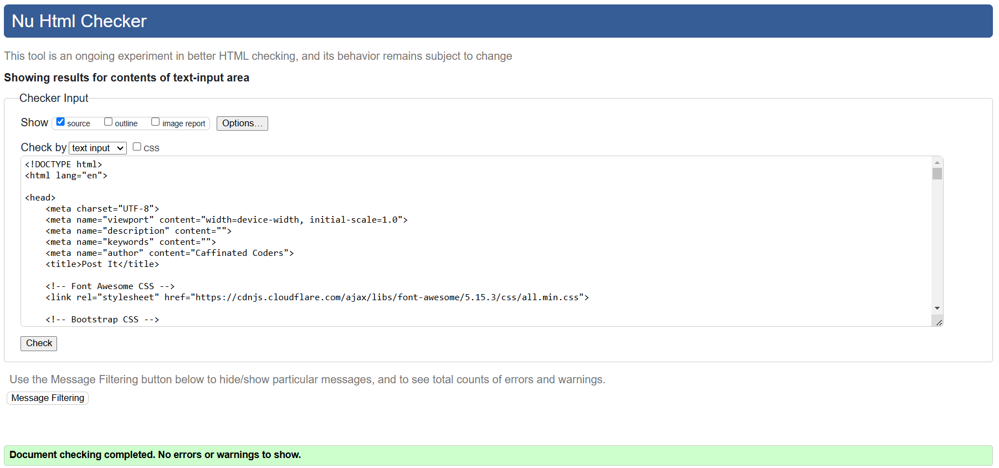
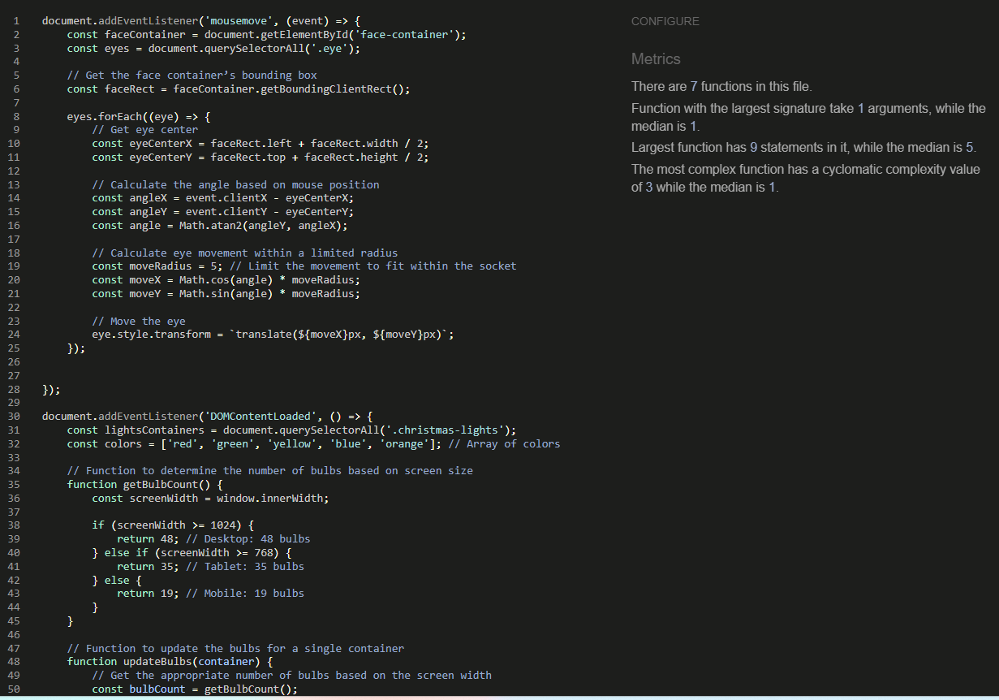
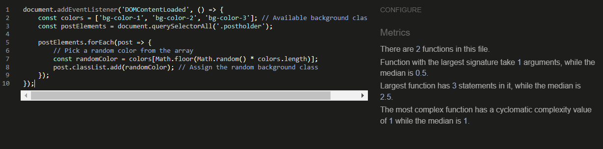
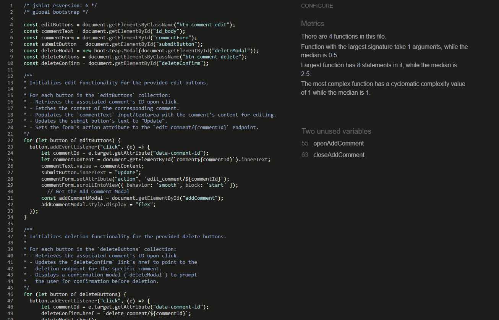
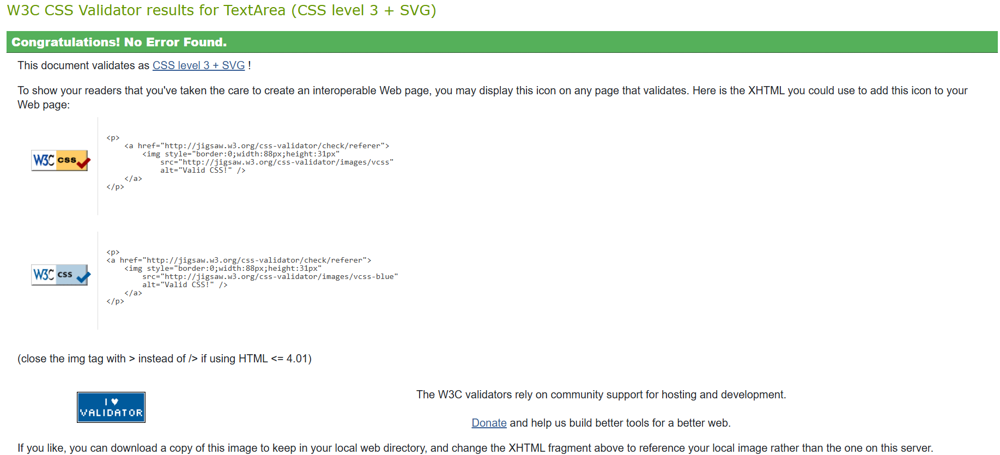

# Testing

This is the TESTING file for the [Post It](https://post-it-project-a1c97a5ab437.herokuapp.com/) website.

Return back to the [README.md](README.md) file.

## Testing Contents  
  
- [Testing](#testing)
  - [Testing Contents](#testing-contents)
  - [Validation](#validation)
    - [HTML Validation](#html-validation)
    - [JavaScript Validation](#javascript-validation)
    - [Python Validation](#python-validation)
    - [CSS Validation](#css-validation)
    - [Lighthouse Scores](#lighthouse-scores)
    - [Wave Accessibility Evaluation](#wave-accessibility-evaluation)
  - [Manual Testing](#manual-testing)
    - [User Input/Form Validation](#user-inputform-validation)
    - [Browser Compatibility](#browser-compatibility)
    - [Testing User Stories](#testing-user-stories)
    - [Dev Tools/Real World Device Testing](#dev-toolsreal-world-device-testing)
  - [Bugs](#bugs)
   - [Known bugs](#known-bugs)

## Validation

### HTML Validation

We used [HTML W3C Validator](https://validator.w3.org) to validate all of the HTML files.

Due to using Jinja syntax such as ' we had to use a different approach to checking the HTML as the validator would show errors if copying the HTML direct from the files in the Post It project. The method used to check the HTML was as follows:

- Using the deployed version from Heroku I navigated to each page.
- Right clicking on the page brought up a options menu with the option to view the page source located at the bottom.
- The complete HTML code for that page will then appear in a separate window.
- Copy that code and paste into the [validate by input](https://validator.w3.org/#validate_by_input) option.
- Check for errors and warnings, fix any issues, and then repeat the steps to revalidate.

 

All HTML pages were validated and pages received a 'No errors or warning to show' result as shown above.

| HTML source Code/Page | Errors | Warnings |
| ---- | ----- | ------|
| Blogs | 0 | 0 |
| Blog Post | 0 | 0 |
| Register | 0 | 0 |
| Log in | 0 | 0 |
| Log out | 0 | 0 |
| Devs | 0 | 0 |

### JavaScript Validation

[JSHint](https://jshint.com/) was used to validate the small amount of JavaScript code added to the project. External JS, for Bootstrap purposes, obtained via [CDN](https://cdn.jsdelivr.net/npm/bootstrap@5.0.1/dist/css/bootstrap.min.css) was not validated through JSHint.

| Page | Screenshot | Errors | Warnings |
| ---- | ------ | ------ | ------ | 
| base.html |  | none | none |
| index.html |  | none | none |
| post_detail.html |  | none | none |

### Python Validation

[CI Python Linter](https://pep8ci.herokuapp.com) was used to validate the Python files that were created or edited by any member of the team. No issues presented. Screenshots have been icluded with the results below.

| Feature | admin.py | forms.py | models.py | urls.py | views.py |
| ---- | ---- | ------- | ------ | ----- | -----|
| Config | n/a | n/a | n/a | [No Errors](documentation/testing/config_urls.png) | n/a |
| Event | [No Errors](documentation/testing/event_admin.png) | [No Errors](documentation/testing/event_forms.png) | [No Errors](documentation/testing/event_models.png) | [No Errors](documentation/testing/event_urls.png) | [No Errors](documentation/testing/event_views.png) |
| Bio | [No Errors](documentation/testing/bio_admin.png) | n/a | [No Errors](documentation/testing/bio_models.png) | [No Errors](documentation/testing/bio_urls.png) | [No Errors](documentation/testing/bio_views.png) |

### CSS Validation

[W3C CSS Validator](https://jigsaw.w3.org/css-validator/) was used to validate my CSS file. External CSS for Bootstrap, provided by [CDN](https://cdn.jsdelivr.net/npm/bootstrap@5.0.1/dist/css/bootstrap.min.css) was not tested. 

  

 

### Lighthouse Scores

Lighthouse testing was carried out in Incognito mode to acheive the best result. Performance was lower than preferred due to the site being image heavy. Static images used in the sites design were saved in webp. Image types added by a site admin are at there own discretion and could affect the score. The CDNs used for Bootstrap were also noted in the Lighthouse report as causing issue with performance. This report will be reviewed for future development of Post It to raise this score.
  

*Desktop Paginated Blogs Page*

*Desktop Blog Post Page*  

*Desktop Blog Post Page*
  

### Wave Accessibility Evaluation 

The WAVE report tool was used to check accesability

## Manual Testing

### User Input/Form Validation

Testing was carried out on desktop using a Chrome browser to ensure all forms take the intended input and process the input appropriately.

| Feature | Tested? | User Input required | User Feedback Provided | Pass/Fail | Fix |
| ------- | ------- | ------------------- | ---------------------- | --------- | --- |
| Navbar | Yes | Click | The user is directed to the specific page as intended | Pass | - |
| Register Page | Yes | Username/Password. Email is optional | Empty username and password fields prompt the user. [username/password](documentation/testing/register_prompt.png) too similar, password too short | Pass | - |
| Login | Yes | Username and Password | Username and Password must be exactly as originally registered. User notified once successfully signed in. | Pass | - |
| Comment Box (Registered User) | Yes | Text input accepted | User is thanked for their comment | Pass | - |
| Edit Comment (Registered, Author) | Yes | Click button to choose Edit | Comment appears in comment box for update and update button appears underneath. When pressed the user is infomred that the comment has been updated | Pass | - |
| Delete Comment (Registered, Author) | Yes | Click button to choose Delete comment | A [modal](documentation/testing/delete_comment.png) pops up asking the user if they are sure they want to delete their comment | Pass | - |

### Browser Compatibility 

Post It was tested on the following browsers. New users were created and old users data edited. All features were tested and no issues found:

- Chrome v131.0.6778.86
- Edge v131.0.2903.51
- Safari v18.1.1

### Testing User Stories 

User Stories are documented in the Post It [Github Projects Board](https://github.com/users/Yazhmd/projects/4). User Stories are numbered, with Acceptance Criteria and Tasks detailed within. All features were tested to ensure that they provided the user with the expected output and action.

| User Story | Acceptance Criteria Met? | Tested | Response | Pass/Fail | Fix |
| ---- | ---- | ----- | ---- | ----- | ---- |
| Admin dashboard | Yes | Yes | No issues | Pass | - |
| User Authentication | Yes | Yes | No issues | Pass | - |
| Admin event creation | Yes | Yes | No issues | Pass | - |
| User event feed | Events are listed by start date. There is no search functionality | Yes | No issues | Pass | - |
| Event commenting | Yes | Yes | No issues | Pass | - |

### Dev Tools/Real World Device Testing

Responsive testing was carrired out using Google Dev Tools on the devices detailed within the below table. Responsiveness was evident on all features throughout all tested devices. Occassionally the page would have to be refreshed as the page would load zoomed in or out on the simualted device. When refreshed and CSS checked the desired outcome was observed. It is suspected that this was down to a caching issue.
  
**Dev Tools Device Testing**
| Device | Feature | Issue | Fix |
| ---- | ----- | ---- | ----- |
| iPhone SE | All features | No issues | None needed |
| iPad Air | All features | No issues | None needed |

**Real World Device Testing**
| Device      | Feature    | Issue  | Fix  | 
| ------------| ---------- | ------ |------|
| MSI Modern 15 H B13M | All features | No issues | None needed |

## Bugs

| No. | Bug | Solved | Fix | Commit no. |
| --- | ---- | ----- | --- | ---------- |
| 1 | Edited comments required approval | Yes | Amend cooment_edit to comment.approved = True | ec3f833 |
| 2 | Elf Character moved under the footer | Yes | Amended Elf position | 6b43f6b | 
| 3 | Posts ordering by created date | Yes | Set order status to -event_start | e228c19 |
| 4 | Could not access database | Yes | Extra database had been added to requirements.txt. No issues once removed | 85e76c4 |

### Known bugs